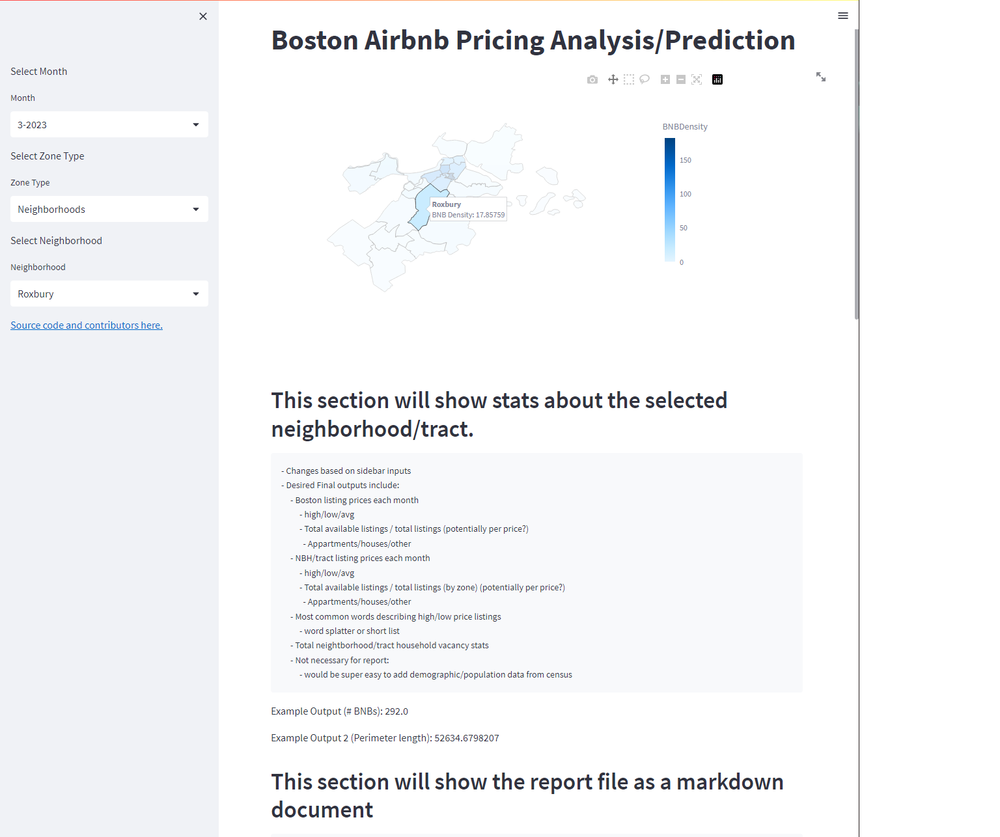

# Research Proposal: Analysis of Boston Airbnb Listings
### Big Picture Question: What attributes about a Boston Airbnb listing are most influential to its list price?

By Tommy McDade, Brooks Walsh, and Taylor Sheridan

## Research Questions

**Geographic Relationships**
1. Do Airbnb hosts take into consideration the amount of vacant housing units (not listings, but total houses) in the census tract/neighborhood when setting a list price?
    - If so, which is more important, the tract or the neighborhood (in other words, which area is a better predictor of price)?
2. What are the most commonly used words in the descriptions/amenities/reviews of the Airbnb listings with the highest/lowest prices?
    - Does this change with geographic region?
3. Are Airbnb prices influenced by the price of nearby Airbnb listings?
    - Spatial Regression
    
- *The findings of these research questions will be reported in a notebook/markdown file (similar to midterm report)*

**Prediction**
1. After the important relationships are determined, we will use regression models and machine learning to create an accurate predictor of list prices, grouped by neighborhood/tract (from 3/2024 to 3/2025). 
    - Predicted prices will change per desired listing
        - We will include predicted high price, low price, and most likely price
    - Based on a predicted prices, we will report the probability that a listing at this price is available.
        - What attributes are the biggest influences to this probability?
2. We will also predict the amount of available/total listings grouped by neighborhood.
    - To be used as an indicator
    - Additionally, to be used in tandem with the above prediction for a better report

- *The results of our prediction models will be displayed on a streamlit dashboard (with the research questions analysis attached)*
    - Desired Prediction Final outputs include (This list also appears in dashboard proposal png):
         - Boston listing prices each month
              - high/low/avg
              - Total available listings / total listings (potentially per price?)
                - Appartments/houses/other
         - NBH/tract listing prices each month
              - high/low/avg
              - Total available listings / total listings (by zone) (potentially per price?)
                - Appartments/houses/other
         - Most common words describing high/low price listings
              - word splatter or short list
         - Total neightborhood/tract household vacancy stats
         - Not necessary for report:
              - would be super easy to add demographic/population data from census

**Discussion of Cross Validation, Out-of-sample methods, and the data sample format**
- K-Fold Cross Validation
    - Housing prices change over time, so we will have to create a training data set that represents all change over time
        - We cannot do a random split of data for the holdout sample because it will cause "over-accuracy"
        - Instead we will using rolling OOS testing following the guide in the textbook (months instead of years):
            1. The holdout sample will be the last 3 years. (15%)
            2. Train and evaluate many models. For each model:
                1. Train a model on year 1, and predict outcomes in year 2.
                2. Then train a model on years 1 and 2, and predict outcomes in year 3.
                3. Then train a model on years 1 - 3, and predict outcomes in year 4.
                4. Then train a model on years 1 - 4, and predict outcomes in year 5.
                5. ...
                6. Then train a model on years 1 - 16, and predict outcomes in year 17.
            3. Pick your preferred model.
- Our final desired output is a range of predicted prices, grouped by neighborhood, for each month from 3/2024 - 3/2025


## Necessary Data

1. The Data will be primarily collected from [Inside Airbnb](http://insideairbnb.com/get-the-data/):
    - To download:
        - Click the link above and use "ctrl+F" to search "Boston"
        - We are using the first 3 data files (does not include neighborhoods, we get that data from the Census Bureau)
- These files include:
    - "listings.csv.gz"
        - Detailed listings data
        - Unit of observation: A Boston Airbnb listing
        - All the data were obtained on either **3/19/2023 or 3/20/2023**
    - "reviews.csv.gz"
        - Detailed review data
        - Unit of observation: A review of a Boston Airbnb listing with an attached listing_id
        - Reviews date range: **3/21/2009 - 3/19/2023**
    - "calendar.csv.gz"
        - Calendar data including listing availability, prices, and min/max nights (into near future)
        - Unit of observation: Days
        - Calendar range: **3/19/2023 - 3/18/2024**
    - **For additional robustness**
        - We are considering whether or not to include archived listing data back to 6/13/2022
        - It is found in the same location and is in the same format (click "show archived data", scroll to 13 June, 2022)
        - The addition of this data would allow for a better prediction and a website with more options for data
        - We would have to be careful of overlapping/gaps in data
        

2. For use in the dashboard and for stat collection, we will need **2020 Census neighborhood data**:
    - The shapefile for neighborhood outlines is found [here](https://data.boston.gov/dataset/census-2020-block-group-neighborhoods/resource/ed89fab7-aa21-42ce-874b-1b4971ab50fb)
        - We can use this data to map the generally-recognized neighborhoods of Boston
    - Neighborhood-level census statistics are found [here](https://data.boston.gov/dataset/2020-census-for-boston/resource/5800a0a2-6acd-41a3-9fe0-1bf7b038750d)
        - This data frame contains population/demographic statistics

3. For use in the dashboard and for stat collection, we will need **2020 census tract data**:
    - The shapefile for tract outlines is found [here](https://data.boston.gov/dataset/census-2020-tracts)
        - We can use this data to map the census tracts of Boston
    - Tract-level census statistics are found [here](https://data.boston.gov/dataset/2020-census-for-boston/resource/013aba13-5985-4067-bba4-a8d3ca9a34ac)
        - This data frame contains population/demographic statistics


4. The **raw inputs** for this project will be the data frames from *Inside Airbnb* as well as a data frame and a shapefile from Census data
    - All of these data sets will be saved to a folder called "inputs"
    - Any important dataframes/visuals that are created will be saved to a folder called "outputs"

5. High-level data cleaning plan:
- The data sets that come from Inside Airbnb are fairly clean
    - Some variables like date and price are in the wrong data type
    - There are some variables that are very specific, and therefore have a significant amount of NAN values
    - To make effective use of these data, we have to merge some (if not all) of the data frames together
    
- The shapefiles from the 2020 census are not in a usable format originally
    - luckily there is a package for python that reads shapefiles effectively:
        - ```import geopandas as gpd```

- The 2020 Census stats data frames have bad column names and are strangely formatted:
    - Helpful documentation is found [here](https://www2.census.gov/programs-surveys/decennial/2020/technical-documentation/complete-tech-docs/summary-file/2020Census_PL94_171Redistricting_StatesTechDoc_English.pdf)
    - We will likely have to do some re-indexing of some kind

## Streamlit Dashboard Proposal 
[link to dashboard repo](https://github.com/Brooks377/SSLS_dashboard)


