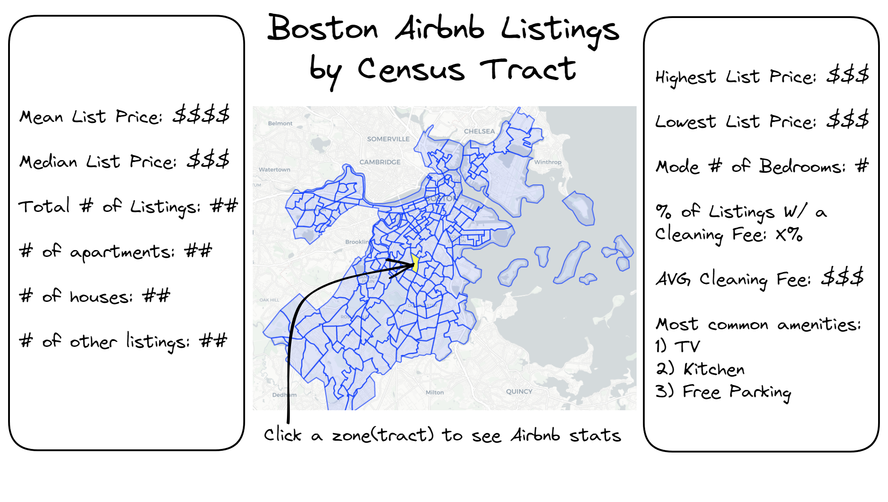

# Research Proposal: Analysis of Boston Airbnb Listings
### Big Picture Question: What attributes about a Boston Airbnb listing are most influential to its list price?

By Tommy McDade, Brooks Walsh, and Taylor Sheridan

## Research Questions

**Relationships**
1. Do Airbnb hosts take into consideration the amount of vacant housing units in the census tract/neighborhood when setting a list price?
    - If so, which is more important, the tract or the neighborhood (in other words, which area is a better predictor of price)?
2. What are the most commonly used words in the descriptions/amenities/reviews of the Airbnb listings with the highest/lowest prices?
3. Are Airbnb prices influenced by the price of nearby Airbnb listings?
    - Spatial Regression

**Prediction**
1. After the important relationships are determined, we will use regression models and machine learning to create an accurate predictor of list prices, extending past 2024. 
    - Based on a predicted price, we will report the probability that a house this price is booked vs. available.
    - In addition, we will report the highest predicted price that has an *"acceptable"* probability of being booked.
2. We will also predict the amount of vacant/booked listings grouped by neighborhood.
    - To be used as an indicator
    - Additionally, to be used in tandem with the above prediction for a better report

**Discussion of Cross Validation, Out-of-sample methods, and the data sample format**
- CV STUFF
- OOS STUFF
- PRO/CON of SINGLE CROSS SECTION (not exactly sure what he means here)


## Necessary Data

1. The Data will be primarily collected from [Inside Airbnb](http://insideairbnb.com/get-the-data/):
    - To download:
        - Click the link above and use "ctrl+F" to search "Boston"
        - We are using the first 3 data files (does not include neighbourhoods)
- These files include:
    - "listings.csv.gz"
        - Detailed listings data
        - Unit of observation: A Boston Airbnb listing
        - All the data were obtained on either **3/19/2023 or 3/20/2023**
    - "reviews.csv.gz"
        - Detailed review data
        - Unit of observation: A review of a Boston Airbnb listing with an attached listing_id
        - Reviews date range: **3/21/2009 - 3/19/2023**
    - "calendar.csv.gz"
        - Calendar data including listing availability, prices, and min/max nights (into near future)
        - Unit of observation: Days
        - Calendar range: **3/19/2023 - 3/18/2024**

2. For use in the dashboard, we will need **2020 Census neighborhood data**:
    - The shapefile for neighborhood outlines is found [here](https://data.boston.gov/dataset/census-2020-block-group-neighborhoods/resource/ed89fab7-aa21-42ce-874b-1b4971ab50fb)
        - We can use this data to map the generally-recognized neighborhoods of Boston
    - Neighborhood-level census statistics are found [here](https://data.boston.gov/dataset/2020-census-for-boston/resource/5800a0a2-6acd-41a3-9fe0-1bf7b038750d)
        - This data frame contains population/demographic statistics

3. To display interesting maps and geographic data (potential to elaborate further on neighborhood stats), we will use **2020 census tract data**:
    - The shapefile for tract outlines is found [here](https://data.boston.gov/dataset/census-2020-tracts)
        - We can use this data to map the census tracts of Boston
    - Tract-level census statistics are found [here](https://data.boston.gov/dataset/2020-census-for-boston/resource/013aba13-5985-4067-bba4-a8d3ca9a34ac)
        - This data frame contains population/demographic statistics


4. The **raw inputs** for this project will be the 3 data frames from *Inside Airbnb* as well as a data frame and a shapefile from Census data
    - All of these data sets will be saved to a folder called "inputs"
    - Any important dataframes/visuals that are created will be saved to a folder called "outputs"

5. High-level data cleaning plan:
- The 3 data sets that come from Inside Airbnb are fairly clean
    - Some variables like date and price are in the wrong data type
    - There are some variables that are very specific, and therefore have a significant amount of NAN values
    - To make effective use of these data, we have to merge some (if not all) of the data frames together
    
- The shapefiles from the 2020 census are not in a usable format originally
    - luckily there is a package for python that reads shapefiles effectively:
        - ```import geopandas as gpd```

- The 2020 Census stats data frames have bad column names and are strangely formatted:
    - Helpful documentation is found [here](https://www2.census.gov/programs-surveys/decennial/2020/technical-documentation/complete-tech-docs/summary-file/2020Census_PL94_171Redistricting_StatesTechDoc_English.pdf)
    - We will likely have to do some re-indexing of some kind

## Dashboard Proposal (**GOTTA CREATE NEW DASHBOARD W/ NEIGHBORHOODS + NEW STATS**)
